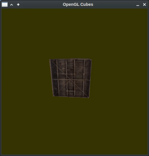

controls:
- mouse and arrow keys --> movement
- spacebar --> acceleration
- 1-6 --> change diffuse color
- enter/backspace --> change diffuse color intensity

compile with:
- g++ src/main.cpp src/utils/shader_tools.cpp -lGL -lGLEW -lglfw

